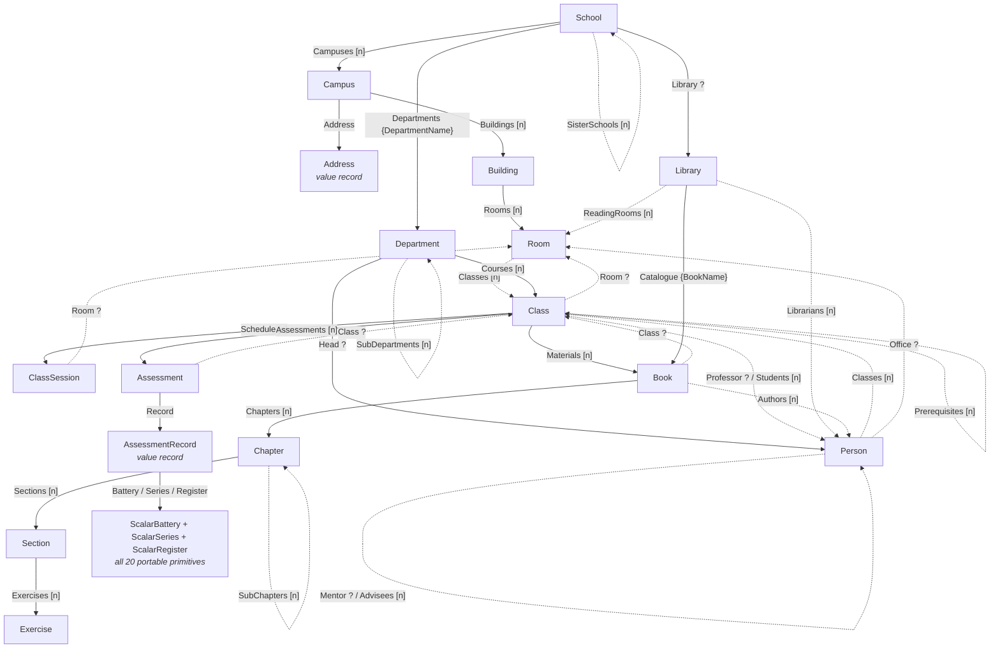
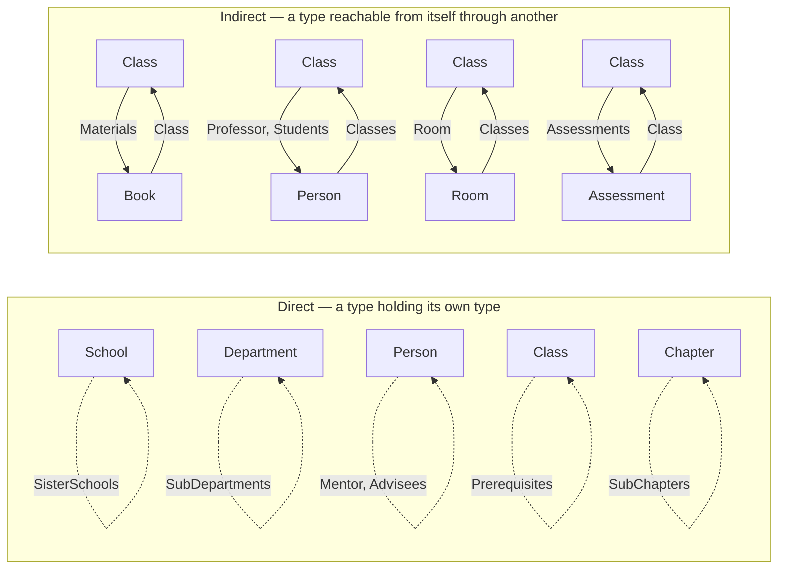

# DotNetSchema.Fixtures

A deliberately awkward object graph, dressed up as a school.

The project exists to give the generator tests something hard to chew on: a schema that is deeply
nested, mutually recursive, and covers every portable primitive type as a value, inside a collection and
inside a map. `FixturesService` turns a seed number into a concrete instance of that schema,
deterministically and repeatably.

```csharp
IFixturesService fixtures = new FixturesService();

School school = fixtures.Generate(seed: 1);
School again  = fixtures.Generate(seed: 1);   // identical, on any machine, on any runtime

School wider  = fixtures.Generate(1, new FixtureOptions { MaxDepth = 6, MaxCollectionSize = 5 });
AssessmentRecord scalars = fixtures.GenerateAssessmentRecord(42);   // scalars only, no school around them
```

---

## Contents

- [Coverage](#coverage)
- [Schema](#schema)
  - [Pseudocode](#pseudocode)
  - [Graph](#graph)
  - [Recursion](#recursion)
- [Generation](#generation)
  - [Determinism](#determinism)
  - [Path-derived seeds](#path-derived-seeds)
  - [Depth budget](#depth-budget)
  - [Back-references](#back-references)
  - [Options and cost](#options-and-cost)
- [Schema export](#schema-export)
- [Notes for consumers](#notes-for-consumers)

---

## Coverage

| Requirement | Where it lives |
| --- | --- |
| Every primitive, portable type, once each | `ScalarBattery` — 20 properties, one per type |
| A collection of every such type | `ScalarSeries` — 20 series plus a `byte[]` blob |
| A map of every such type | `ScalarRegister` — 20 string-keyed maps, plus `int`-, `Guid`-, `enum`- and `DateOnly`-keyed maps |
| A nested record | `Campus.Address`, `Assessment.Record`, and most other edges |
| A nested collection of records | `Campus.Buildings`, `Class.Students`, `Book.Chapters`, … |
| A nested map of records | `School.Departments` (enum-keyed), `Library.Catalogue` (enum-keyed) |
| Four or more levels of nesting | `School → Campus → Building → Room → Class → Book → Chapter → Section → Exercise` (9) |
| Direct recursion | `School.SisterSchools`, `Person.Mentor`, `Person.Advisees`, `Class.Prerequisites`, `Department.SubDepartments`, `Chapter.SubChapters` |
| Indirect recursion | `Class ↔ Book`, `Class ↔ Person`, `Class ↔ Room`, `Class ↔ Assessment` |

### What counts as "portable"

Twenty types are covered, chosen because each has an unambiguous representation outside the CLR — in
JSON, in TypeScript, on a wire:

`bool` · `sbyte` · `byte` · `short` · `ushort` · `int` · `uint` · `long` · `ulong` · `float` · `double` ·
`decimal` · `char` · `string` · `Guid` · `DateOnly` · `TimeOnly` · `TimeSpan` · `DateTime` ·
`DateTimeOffset`

Deliberately left out, and why:

| Excluded | Reason |
| --- | --- |
| `nint`, `nuint`, `IntPtr`, `UIntPtr` | Width depends on the process, so no fixed representation |
| `Int128`, `UInt128` | No portable counterpart in JSON or TypeScript |
| `Half` | Not portable, and rounds differently across platforms |
| `object`, `dynamic` | No schema to speak of |

Two conventions inside the covered set are worth calling out, because both are places round-tripping
tends to go wrong and the fixtures are built to catch it:

- every `DateTime` is generated with `Kind == Utc`, so a serialiser that silently reinterprets local time
  will produce a mismatch;
- every `DateTimeOffset` is generated with a *non-zero* offset drawn from `-08:00 … +09:00`, so a
  serialiser that normalises to UTC will lose information the fixture can detect.

---

## Schema

### Pseudocode

```pseudocode
enum ClassName      { Algebra, Geometry, Calculus, Statistics, Biology, Chemistry, Physics,
                      ComputerScience, Robotics, Astronomy, WorldHistory, Geography, Literature,
                      CreativeWriting, Latin, Philosophy, Economics, MusicTheory, VisualArts,
                      PhysicalEducation }
enum BookName       { PrinciplesOfAlgebra, EuclideanFoundations, CalculusInMotion, ... (20 titles) }
enum DepartmentName { Mathematics, NaturalSciences, ComputerScience, Humanities, SocialSciences,
                      Arts, Athletics, ContinuingEducation }
enum PersonRole     { Student, Professor, TeachingAssistant, Librarian, Counsellor, Administrator }
enum Term           { Autumn, Winter, Spring, Summer }
enum RoomKind       { LectureHall, Classroom, Laboratory, SeminarRoom, Studio, Workshop,
                      Gymnasium, ReadingRoom, Auditorium }
enum AssessmentKind { Quiz, MidtermExam, FinalExam, Essay, LabReport, Practical, OralDefence,
                      GroupProject }


// ── The estate ────────────────────────────────────────────────────────────────

record School {
    Id             : Guid
    Name           : string
    Motto          : string
    FoundedOn      : DateOnly
    IsAccredited   : bool
    EnrollmentCap  : ushort
    Endowment      : decimal
    Campuses       : Array<Campus>
    Departments    : Map<DepartmentName, Department>        // map of records, enum key
    Library        : Library?
    SisterSchools  : Array<School>                          // ↺ direct recursion
}

record Campus {
    Id, Name, OpenedOn : Guid, string, DateOnly
    AreaHectares       : double
    Address            : Address                            // value record, never truncated
    Buildings          : Array<Building>
}

record Address {
    Street, City, PostalCode, CountryCode : string
    Latitude, Longitude                   : double
}

record Building {
    Id, Name      : Guid, string
    FloorCount    : short
    IsAccessible  : bool
    BuiltInYear   : ushort
    Rooms         : Array<Room>
}

record Room {
    Id, Code : Guid, string
    Kind     : RoomKind
    Seats    : ushort
    Floor    : sbyte                                        // negative = basement
    Classes  : Array<Class>                                 // ↻ indirect, back into Class
}


// ── Academia ──────────────────────────────────────────────────────────────────

record Department {
    Id              : Guid
    Name            : DepartmentName
    CostCentre      : string
    AnnualBudget    : decimal
    EstablishedOn   : DateOnly
    Head            : Person?
    Courses         : Array<Class>
    SubDepartments  : Array<Department>                     // ↺ direct recursion
}

record Person {
    Id                : Guid
    GivenName         : string
    FamilyName        : string
    Role              : PersonRole
    BornOn            : DateOnly
    Email             : string
    IsActive          : bool
    GradePointAverage : double
    Classes           : Array<Class>                        // ↻ indirect: Person → Class → Person
    Grades            : Map<ClassName, int>                 // map with an enum key
    ContactMethods    : Map<string, string>
    Mentor            : Person?                             // ↺ direct recursion
    Advisees          : Array<Person>                       // ↺ direct recursion, across a collection
    Office            : Room?                               // ↻ indirect: Person → Room → Class → Person
}

record Class {
    Id                 : Guid
    Name               : ClassName
    Code               : string
    Term               : Term
    AcademicYear       : ushort
    Credits            : double
    Seats              : byte
    IsEnrollmentOpen   : bool
    Synopsis           : string
    Professor          : Person?                            // ↻ indirect
    Students           : Array<Person>                      // ↻ indirect
    Materials          : Array<Book>                        // ↻ indirect: Class → Book → Class
    Prerequisites      : Array<Class>                       // ↺ direct recursion
    Schedule           : Array<ClassSession>
    Assessments        : Array<Assessment>
    Room               : Room?                              // ↻ indirect
}

record ClassSession {
    Id        : Guid
    Day       : DayOfWeek
    StartsAt  : TimeOnly
    Duration  : TimeSpan
    IsRemote  : bool
    Room      : Room?
}


// ── The library ───────────────────────────────────────────────────────────────

record Library {
    Id, Name      : Guid, string
    VolumeCount   : uint
    OpensAt       : TimeOnly
    ClosesAt      : TimeOnly
    Catalogue     : Map<BookName, Book>                     // map of records, enum key
    Librarians    : Array<Person>
    ReadingRooms  : Array<Room>
}

record Book {
    Id                 : Guid
    Name               : BookName
    Isbn               : string
    Edition            : byte
    PageCount          : ushort
    Price              : decimal
    PublishedOn        : DateOnly
    HasDigitalLicence  : bool
    Class              : Class?                             // ↻ indirect: Book → Class → Book
    Authors            : Array<Person>
    Chapters           : Array<Chapter>
}

record Chapter {
    Id                    : Guid
    Ordinal               : int
    Title                 : string
    StartPage             : ushort
    EstimatedReadingTime  : TimeSpan
    Sections              : Array<Section>
    SubChapters           : Array<Chapter>                  // ↺ direct recursion
}

record Section {
    Id, Number, Heading, Body : Guid, string, string, string
    WordCount                 : int
    Exercises                 : Array<Exercise>
}

record Exercise {
    Id, Label, Prompt  : Guid, string, string
    Difficulty         : float
    HasWorkedSolution  : bool
    Marks              : byte
}


// ── Assessment, and the scalar coverage bundles ───────────────────────────────

record Assessment {
    Id            : Guid
    Kind          : AssessmentKind
    Title         : string
    Weight        : decimal
    MaximumMarks  : ushort
    DueAt         : DateTimeOffset
    IsOpenBook    : bool
    Class         : Class?                                  // ↻ indirect
    Record        : AssessmentRecord                        // value record, never truncated
}

record AssessmentRecord {
    Battery   : ScalarBattery      // every portable scalar, once
    Series    : ScalarSeries       // every portable scalar, in a collection
    Register  : ScalarRegister     // every portable scalar, in a map
}

record ScalarBattery {
    IsProctored         : bool              CurveAdjustment     : sbyte
    RawScore            : byte              SeatNumber          : short
    ItemCount           : ushort            TotalPoints         : int
    SubmissionSequence  : uint              ElapsedTicks        : long
    IntegrityChecksum   : ulong             PercentileRank      : float
    ScaledScore         : double            WeightedAverage     : decimal
    LetterGrade         : char              Remarks             : string
    ResponseId          : Guid              AdministeredOn      : DateOnly
    StartedAt           : TimeOnly          AllowedDuration     : TimeSpan
    RecordedAtUtc       : DateTime          SubmittedAt         : DateTimeOffset
}

record ScalarSeries {
    AttemptedFlags       : Array<bool>            CurveAdjustments     : Array<sbyte>
    RawScores            : Array<byte>            SeatNumbers          : Array<short>
    AttemptCounts        : Array<ushort>          PointsPerItem        : Array<int>
    SubmissionSequences  : Array<uint>            ElapsedTicksPerItem  : Array<long>
    IntegrityChecksums   : Array<ulong>           PercentileRanks      : Array<float>
    ScaledScores         : Array<double>          WeightedAverages     : Array<decimal>
    LetterGrades         : Array<char>            Remarks              : Array<string>
    ResponseIds          : Array<Guid>            MarkedOn             : Array<DateOnly>
    OpenedAt             : Array<TimeOnly>        Durations            : Array<TimeSpan>
    RecordedAtUtc        : Array<DateTime>        SavedAt              : Array<DateTimeOffset>
    AnswerSheetScan      : Array<byte>            // opaque binary payload
}

record ScalarRegister {
    AnsweredByItem       : Map<string, bool>      CurveByItem          : Map<string, sbyte>
    RawScoreByItem       : Map<string, byte>      SeatByItem           : Map<string, short>
    AttemptsByItem       : Map<string, ushort>    PointsByItem         : Map<string, int>
    SequenceByItem       : Map<string, uint>      ElapsedTicksByItem   : Map<string, long>
    ChecksumByItem       : Map<string, ulong>     PercentileByItem     : Map<string, float>
    ScaledScoreByItem    : Map<string, double>    WeightByItem         : Map<string, decimal>
    LetterGradeByItem    : Map<string, char>      RemarkByItem         : Map<string, string>
    ResponseIdByItem     : Map<string, Guid>      MarkedOnByItem       : Map<string, DateOnly>
    OpenedAtByItem       : Map<string, TimeOnly>  DurationByItem       : Map<string, TimeSpan>
    RecordedAtUtcByItem  : Map<string, DateTime>  SavedAtByItem        : Map<string, DateTimeOffset>

    // non-string keys, so key conversion is exercised too
    RemarkByItemNumber      : Map<int, string>
    ScoreByResponseId       : Map<Guid, double>
    WeightByAssessmentKind  : Map<AssessmentKind, decimal>
    AttendanceByDate        : Map<DateOnly, ushort>
}
```

### Graph

Solid edges are ownership, dashed edges are references back into the graph. `[n]` marks a collection,
`{k}` a map keyed by `k`.



### Recursion

Stripped of everything else, these are the cycles the schema deliberately contains — the reason a
generator over it needs a termination story at all.



The longest of these runs `Person → Office → Room → Classes → Class → Students → Person`: three hops
home, through two intermediate types. It is also the one most likely to catch a naive reference tracker,
since neither intermediate looks like it belongs to a person.

---

## Generation

### Determinism

`FixturesService.Generate(seed)` is a pure function. The same seed and the same options produce an equal
graph on any machine, any OS and any runtime version.

That last clause is why the implementation does not use `System.Random`. Its seeded algorithm is an
implementation detail the BCL reserves the right to change, and a fixture that shifts under a framework
upgrade is worse than no fixture at all. `StableRandom` is SplitMix64, written out in
[`Generation/StableRandom.cs`](Generation/StableRandom.cs), and every draw is
defined in terms of integer arithmetic:

- `double` and `float` come from exactly representable integer ratios (`x >> 11` over `2^53`), so no
  platform-dependent rounding creeps in;
- `decimal` is built from an integer numerator over a power of ten, so it is exact rather than a rounded
  binary approximation;
- `Guid` values are drawn from the stream and then stamped with the RFC 4122 version-4 bits, so node
  identity is reproducible;
- every string is formatted with `CultureInfo.InvariantCulture`, so the machine's locale cannot leak in.

### Path-derived seeds

Seeds are derived by *path*, not drawn from one running stream. A node's seed is a pure function of its
parent's seed and the name — and ordinal — of the edge that reached it:

```
seed(root)                   = mix(seedNumber)
seed(parent → "Campuses"[2]) = mix(mix(seed(parent) ^ hash("Campuses")) ^ 2 · γ)
```

Two properties follow, and both are load-bearing:

- **Siblings are independent.** Adding a property to a record, widening a collection or reordering a
  sibling cannot disturb an existing subtree. `Generate(1).Campuses[2]` is the same object whether the
  school has three departments or thirty — which is what makes these fixtures usable in assertions that
  are supposed to stay green across unrelated schema edits.
- **A node can be regenerated in isolation**, without walking to it from the root. That is what makes
  back-references work.

### Depth budget

The schema is cyclic. The graphs it produces are not.

Each traversal carries a `MaxDepth` budget that every entity level spends one unit of. When the budget
runs out the graph is truncated: optional references are left `null`, collections are left empty. The
result is always a finite tree, safe to hand to a naive serialiser, a recursive comparer or a plain
`ToString()` — none of which survive a real object cycle.

Value records — `Address`, `AssessmentRecord`, and the three scalar bundles — do not spend budget and are
always filled in. They are cheap, finite, and they are the point of the fixture; truncating them would
mean generating a marking record with no marks in it.

### Back-references

`Book.Class` and `Assessment.Class` point back at the node that owns them. Rather than inventing an
unrelated class there, the generator re-derives the owner from the owner's own seed under a small budget
(`FixtureOptions.BackReferenceDepth`, `0` by default — identity and scalars, no children).

So this holds, and is worth asserting against:

```csharp
var course = fixtures.Generate(1).Departments.Values.First().Courses.First();

foreach (var book in course.Materials)
{
  Debug.Assert(book.Class!.Id   == course.Id);     // same node, re-derived
  Debug.Assert(book.Class!.Name == course.Name);
  Debug.Assert(book.Class!.Code == course.Code);
  Debug.Assert(book.Class!.Materials.Count == 0);  // …but truncated, so the graph stays a tree
}
```

The back-reference is the one place a chain can run one level past `MaxDepth`: a budget of `n` yields at
most `n` entity edges from the root, plus one more if the last node is a back-reference.

### Options and cost

| Option | Default | Effect |
| --- | --- | --- |
| `MaxDepth` | `4` | Entity levels below the root before truncation |
| `MinCollectionSize` / `MaxCollectionSize` | `1` / `3` | Elements per collection |
| `MapSize` | `3` | Entries per map |
| `SeriesLength` | `4` | Elements per scalar series (the binary blob gets `8×`) |
| `OptionalFillRate` | `0.75` | Chance a nullable reference is filled rather than `null` |
| `BackReferenceDepth` | `0` | Budget granted to a back-reference |

Breadth is cheap; depth is not. Cost grows by roughly an order of magnitude per level, so the default
sits at the point where a fixture is still comfortable to eyeball. Measured on `Generate(7)` with
everything else left at its default, serialised size via `System.Text.Json`:

| `MaxDepth` | Time | Serialised size |
| --- | --- | --- |
| 4 (default) | ~5 ms | 0.7 MiB |
| 5 | ~60 ms | 4.5 MiB |
| 6 | ~320 ms | 24 MiB |

Sizes are exact; timings are from one developer machine and are there for the order of magnitude, not
the absolute number.

Two settings worth knowing about:

- `OptionalFillRate = 1.0` fills every nullable reference — the densest graph the depth budget allows.
- `OptionalFillRate = 0.0` leaves them all `null`, which is the quick way to exercise the null paths.

---

## Schema export

This project is a live, in-repository consumer of
[`DotNetSchema`](../../src/DotNetSchema/README.md): it references it, imports its `.targets` and sets
`DotNetSchemaGenerate`. It also pins `DotNetSchemaDefaultFileName` to `schema.json`, so the documents in
`bin/` match the generator's default options and the golden digests. Building the project writes three
JSON Schema documents into the output directory:

| Marked type | Document | What it is there to exercise |
| --- | --- | --- |
| `School` | `school.json` | The whole graph — 19 records, 7 enums and `System.DayOfWeek`, nine levels deep, with every cycle closed by `$ref`. |
| `Assessment`, `AssessmentRecord` | `assessment.json` | Two entry points in one document, sharing `Class`, `Person` and `Room` with `school.json`. |
| `ScalarRegister` | `schema.json` | The default file name, and a type defined in two documents at once. |

The attributes change no generated value: a fixture graph is exactly what it was before they were added.

`Schema/Invalid/` is not part of the school graph and `FixturesService` never constructs any of it. It
holds the shapes an exporter has to have an answer for — a property typed `object`, a generic model, a
record used as a dictionary key, two types with the same short name, two properties with the same JSON
name — so that the diagnostics can be tested against real declarations rather than against types invented
inside a test. They carry `[ExportForTesting]` rather than `[DotNetSchema]`, because marking them
properly would export them, and exporting them would fail this project's own build.

---

## Notes for consumers

**Record equality does not go deep.** The compiler-synthesised `Equals` on a `record` compares reference
members with `EqualityComparer<T>.Default`, which for `IReadOnlyList<T>` and `IReadOnlyDictionary<K,V>`
means *reference* equality. So two separately generated schools are **not** `==`, even though they are
byte-for-byte identical once serialised:

```csharp
fixtures.Generate(1) == fixtures.Generate(1)                        // false — collections differ by reference
Serialize(fixtures.Generate(1)) == Serialize(fixtures.Generate(1))  // true
fixtures.GenerateAssessmentRecord(42).Battery
  == fixtures.GenerateAssessmentRecord(42).Battery                  // true — ScalarBattery holds no collections
```

Compare fixtures on their serialised form, or on the seed that produced them.

**The service is stateless and thread-safe.** `FixturesService` holds no fields; a single instance can be
shared, or registered as a singleton:

```csharp
services.AddSingleton<IFixturesService, FixturesService>();
```

**Where to start, depending on what is under test.**

| Under test | Fixture |
| --- | --- |
| Scalar conversion, precision, date handling | `GenerateAssessmentRecord(seed)` |
| Cycles, depth limits, reference handling | `Generate(seed)` |
| Collection and map handling | `Generate(seed)`, or `ScalarSeries` / `ScalarRegister` directly |
| Throughput or payload size | `Generate(seed, new FixtureOptions { MaxDepth = 6 })` |
| A stable corpus of unrelated inputs | `GenerateMany(seed, count)` |

---

## Layout

```
Schema/          the records — plain, immutable, no dependency on the generator
  Enums/         the seven enums
  Invalid/       shapes that are deliberately wrong, for the JSON Schema exporter's diagnostic tests
Generation/
  FixtureSeed         path-derived seeds
  FixtureOptions      depth and breadth
  FixtureVocabulary   word banks, so fixtures read like a prospectus
  IFixturesService    the public surface
  FixturesService     .cs domain generation · .Graph.cs traversal · .Scalars.cs the scalar bundles
  StableRandom        the deterministic value source (SplitMix64)
```

---

## License

MIT — see [LICENSE.md](../../LICENSE.md).
